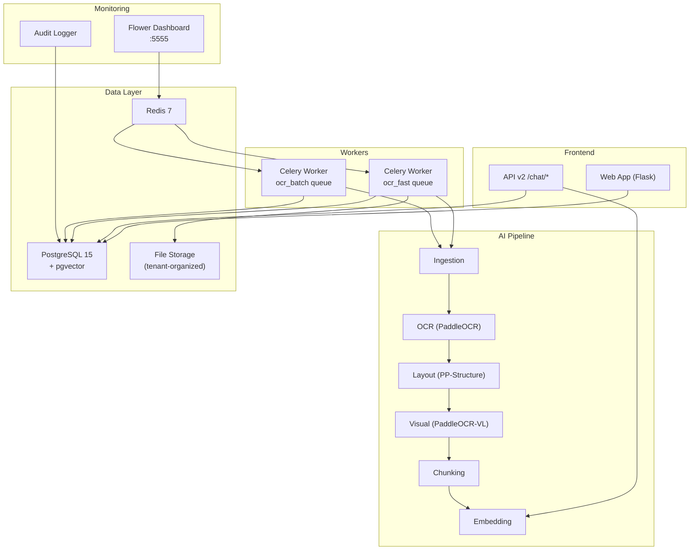

# Guía de Despliegue — AutoOCR Document AI Platform

## Arquitectura del Sistema



---

## Requisitos Previos

| Componente | Versión Mínima | Notas |
|---|---|---|
| Docker + Docker Compose | 24.0+ | Con soporte de GPU (nvidia-docker) |
| NVIDIA Driver | 525+ | Para GPU en contenedores |
| CUDA | 12.x | Requerido para PaddleOCR GPU |
| RAM | 16 GB | 32 GB recomendado |
| Disco | 50 GB SSD | Para modelos + datos |

---

## Despliegue Paso a Paso

### 1. Configuración Inicial

```bash
# Clonar repositorio
git clone <repo-url> AutoOCR
cd AutoOCR

# Copiar configuración
cp config.yaml.example config.yaml
```

### 2. Configurar Variables de Entorno

Editar `docker-compose.yml` o crear un `.env`:

```bash
# Feature Flags (0 = desactivado, 1 = activado)
AUTOOCR_ENABLE_LAYOUT=1
AUTOOCR_ENABLE_VL=0          # Activar cuando VL model esté descargado
AUTOOCR_ENABLE_RAG=1
AUTOOCR_ENABLE_PGVECTOR=1
AUTOOCR_ENABLE_MULTI_TENANT=0  # Activar después de migrar usuarios

# Database
DB_HOST=db
DB_USER=postgres
DB_PASSWORD=<contraseña-segura>
DB_NAME=autoocr

# LLM (LM Studio en host)
LLM_BASE_URL=http://host.docker.internal:1234/v1
```

### 3. Levantar Servicios

```bash
# Construir y arrancar todo
docker-compose up -d --build

# Verificar que los servicios estén corriendo
docker-compose ps

# Ver logs en tiempo real
docker-compose logs -f autoocr
```

### 4. Ejecutar Migraciones de Base de Datos

```bash
# Preview (sin cambios)
docker exec autoocr_gpu python -m scripts.migrate --dry

# Aplicar migraciones
docker exec autoocr_gpu python -m scripts.migrate
```

### 5. Verificar Instalación

```bash
# Test de servicios
docker exec autoocr_gpu python scripts/test_services.py

# Ejecutar tests
docker exec autoocr_gpu pytest tests/test_pipeline.py -v

# Benchmark
docker exec autoocr_gpu python scripts/benchmark.py --pages 10

# Estimación de costes
docker exec autoocr_gpu python scripts/benchmark.py --costs
```

### 6. Monitorización

| Servicio | URL | Descripción |
|---|---|---|
| Web App | http://localhost:8081 | Interfaz principal |
| Flower | http://localhost:5555 | Dashboard de colas Celery |
| PostgreSQL | localhost:5433 | Puerto externo BD |

---

## Activación Gradual de Funcionalidades

El despliegue se controla mediante **feature flags**. Secuencia recomendada:

```
Semana 1: ENABLE_LAYOUT=1  (layout detection)
Semana 2: ENABLE_RAG=1     (chunking + embeddings + chat)
Semana 3: ENABLE_VL=1      (visual analysis)
Semana 4: ENABLE_MULTI_TENANT=1 (tenant isolation)
```

Para cambiar un flag en caliente:

```bash
# Actualizar variable y reiniciar worker
docker-compose exec autoocr bash -c "export AUTOOCR_ENABLE_VL=1"
docker-compose restart autoocr worker
```

---

## Plan de Rollback

### Nivel 1: Desactivar Feature (sin downtime)

```bash
# Ejemplo: desactivar RAG si hay problemas
# En docker-compose.yml:
AUTOOCR_ENABLE_RAG=0

docker-compose restart autoocr worker
```

### Nivel 2: Revertir Migración de BD

```bash
# Las migraciones NO tienen auto-rollback.
# Para revertir 001_initial_schema.sql:

# 1. Backup primero
docker exec autoocr_db pg_dump -U postgres autoocr > backup_$(date +%Y%m%d).sql

# 2. Las tablas nuevas son independientes — simplemente desactivar flags
#    Las tablas antiguas (documents, ocr_texts, etc.) NO se modifican
```

### Nivel 3: Rollback completo a versión anterior

```bash
# 1. Parar servicios
docker-compose down

# 2. Restaurar código
git checkout <commit-anterior>

# 3. Restaurar BD (si es necesario)
docker exec -i autoocr_db psql -U postgres autoocr < backup.sql

# 4. Arrancar
docker-compose up -d
```

> [!IMPORTANT]
> Las tablas nuevas (`chunks`, `embeddings`, `chat_sessions`, etc.) son **aditivas**.
> El código antiguo no las usa, así que pueden coexistir sin conflicto.

---

## Estructura de Archivos del Proyecto (Post-Evolución)

```
AutoOCR/
├── migrations/
│   └── 001_initial_schema.sql     ← Schema pgvector
├── modules/
│   ├── audit_logger.py            ← Audit trail
│   ├── celery_app.py              ← Worker queues
│   ├── context_builder.py         ← Hybrid RAG retrieval
│   ├── feature_flags.py           ← Feature toggles
│   ├── storage_manager.py         ← Tenant file layout
│   ├── tenant_middleware.py       ← Access control
│   ├── db_manager.py              ← (existente)
│   ├── ocr_manager.py             ← (existente)
│   └── ...
├── pipeline/
│   ├── __init__.py
│   ├── ingestion.py               ← Step A
│   ├── ocr_step.py                ← Step B
│   ├── layout_step.py             ← Step C
│   ├── visual_step.py             ← Step D
│   ├── chunking_step.py           ← Step E
│   ├── embedding_step.py          ← Step F
│   ├── job_manager.py             ← Job tracking
│   └── orchestrator.py            ← Pipeline wiring
├── scripts/
│   ├── benchmark.py               ← Performance & cost
│   └── migrate.py                 ← DB migrations
├── tests/
│   └── test_pipeline.py           ← 25+ test cases
├── web_app/
│   └── routes/
│       └── chat_v2_routes.py      ← RAG chat API
└── docker-compose.yml             ← Infra completa
```
