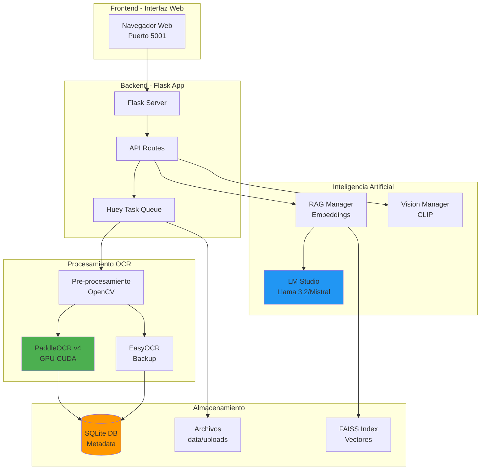
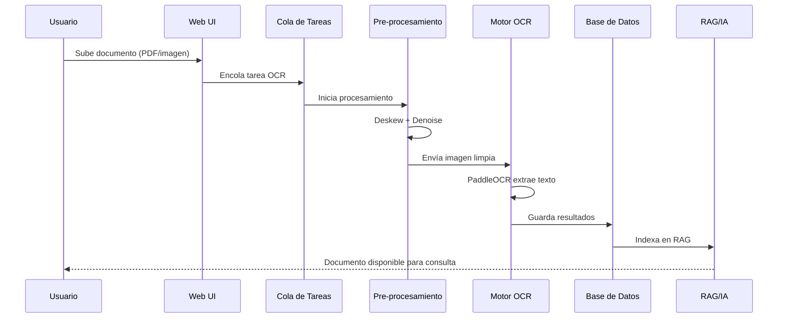
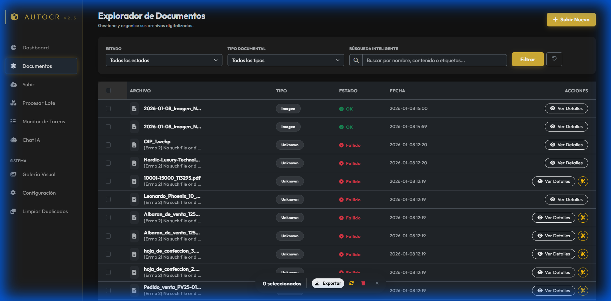
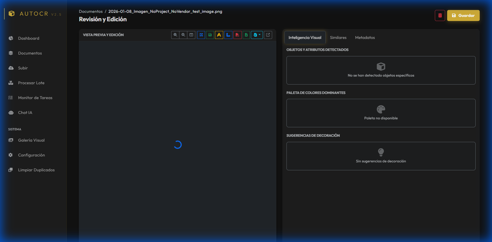
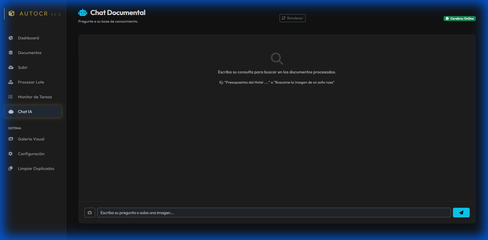
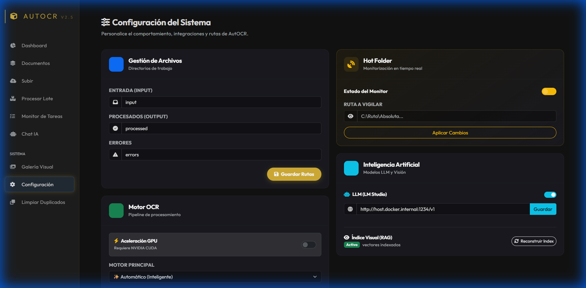

# Manual de Usuario - AutoOCR Enterprise

## 📋 Tabla de Contenidos
1. [Introducción](#introducción)
2. [Arquitectura del Sistema](#arquitectura-del-sistema)
3. [Componentes Principales](#componentes-principales)
4. [Guía de Uso](#guía-de-uso)
5. [Características Avanzadas](#características-avanzadas)
6. [Solución de Problemas](#solución-de-problemas)

---

## Introducción

**AutoOCR** es un sistema inteligente de gestión documental que combina reconocimiento óptico de caracteres (OCR) de última generación con inteligencia artificial local para procesar, organizar y consultar documentos empresariales.

### ¿Qué hace AutoOCR?
- 📄 **Digitaliza** documentos escaneados, PDFs e imágenes
- 🧠 **Extrae** texto, tablas y datos estructurados automáticamente
- 🔍 **Busca** información semántica en tu archivo histórico
- 💬 **Responde** preguntas sobre tus documentos usando IA local
- 🗂️ **Organiza** con carpetas y versionado (próximamente)

---

## Arquitectura del Sistema



### Flujo de Datos



---

## Componentes Principales

### 1. Motores OCR

**PaddleOCR v4 (Principal)**
- Motor chino de última generación
- Aceleración GPU (CUDA)
- Especializado en tablas y layouts complejos
- Detecta automáticamente orientación del texto

**EasyOCR (Respaldo)**
- Respaldo si PaddleOCR falla
- Soporte multi-idioma (español/inglés)
- Modo CPU/GPU flexible

**Pre-procesamiento Inteligente** ⭐ *Nuevo*
- **Deskew**: Endereza documentos escaneados torcidos
- **Denoise**: Elimina ruido y manchas
- **Upscaling**: Mejora imágenes de baja resolución

### 2. Base de Datos

**SQLite** (Actual)
- Base de datos embebida para desarrollo
- Ubicación: `data/digitalizerai.db`
- Almacena metadatos, texto OCR, historial de chat

**Tablas Clave**:
- `documents`: Registro de archivos procesados
- `ocr_texts`: Contenido extraído
- `folders`: Organización jerárquica *(en desarrollo)*
- `document_versions`: Control de cambios *(en desarrollo)*

### 3. Sistema RAG (Retrieval-Augmented Generation)

**¿Qué es RAG?**
RAG combina búsqueda semántica con IA generativa para responder preguntas precisas basadas en tus documentos.

**Cómo Funciona**:
1. Cada documento se divide en "chunks" de ~300 palabras
2. Se genera un embedding (vector numérico) por cada chunk
3. Cuando haces una pregunta, se buscan los chunks más relevantes
4. La IA responde usando **solo** ese contexto

**Citas Automáticas** ⭐ *Nuevo*
- Ahora la IA cite sus fuentes: `[ID: 15]`
- Verificación inmediata del origen de la información

### 4. Integración con LM Studio

AutoOCR usa **LM Studio** como cerebro local:
- Sin costes de API (OpenAI, Google, etc.)
- Privacidad total (datos nunca salen de tu red)
- Modelos compatibles: Llama, Mistral, Phi, etc.

---

## Guía de Uso

### Dashboard Principal


El dashboard muestra:
- **Total documentos**: Archivos procesados
- **Pendientes**: Documentos sin procesar
- **Estado OCR**: Salud del sistema
- **Gráfica temporal**: Actividad de procesamiento

### Subir Documentos

1. Click en **"Subir Documentos"**
2. Arrastra archivos o click en **"Seleccionar"**
3. Formatos aceptados: PDF, JPG, PNG, TIFF
4. El sistema procesará automáticamente en segundo plano

**Estado de Procesamiento**:
- 🟡 Pendiente
- 🔵 Procesando
- 🟢 Completado
- 🔴 Error

### Gestión de Documentos



**Acciones Disponibles**:
- **Ver**: Abre el visor con texto extraído
- **Exportar**: Descarga como TXT/JSON/Excel
- **Eliminar**: Borra documento y datos asociados
- **Buscar**: Filtro por nombre o contenido

### Visor de Documentos



**Pestañas**:
- **Vista Previa**: Imagen original del documento
- **Texto**: Contenido extraído (editable)
- **Markdown**: Versión formateada
- **Tablas**: Datos estructurados
- **Metadatos**: Info técnica (fecha, tamaño, etc.)

### Chat Inteligente



**Ejemplos de Preguntas**:
```
"¿Cuál fue el gasto total en energía este mes?"
"Busca todas las facturas de FakeCompany S.L."
"¿Qué documentos mencionan 'garantía extendida'?"
```

**Respuesta Típica**:
```
El gasto total en energía fue 1,245.50€ [ID: 127]
según la factura de Iberdrola del 15/12/2023.
```

**Botón [ID: 127]**: Click para abrir ese documento específico.

---

## Características Avanzadas

### 1. Carpetas Jerárquicas *(Desactivado)*

Organiza documentos en estructura de árbol:
```
📁 Facturas
  ├── 📁 2024
  │   ├── 📁 Enero
  │   └── 📁 Febrero
  └── 📁 2023
📁 Contratos
📁 Nóminas
```

**Activar**: `config.yaml` → `features.enable_folders: true`

### 2. Control de Versiones *(Desactivado)*

Guarda snapshots antes de cada edición:
- Restaura versiones antiguas
- Rastrea quién cambió qué
- Auditoría completa

**Activar**: `config.yaml` → `features.enable_versioning: true`

### 3. Exportación Masiva

**Formatos Disponibles**:
- **Excel**: Tablas extraídas en .xlsx
- **JSON**: Datos estructurados para APIs
- **TXT**: Texto plano
- **Markdown**: Formato con encabezados

**Uso**: Selecciona múltiples docs → "Exportar Lote"

### 4. Configuración LLM



**Parámetros Clave**:
- **Base URL**: `http://host.docker.internal:1234/v1`
- **Modelo**: Nombre exacto en LM Studio (ej: `llama-3.2-1b`)
- **Timeout**: 60s recomendado
- **Temperatura**: 0.7 (creatividad moderada)

---

## Solución de Problemas

### ❌ "No detecta LM Studio"

**Síntomas**: Chat responde "⚠️ No detecto LM Studio ejecutándose"

**Solución**:
1. Abre LM Studio en tu PC
2. Asegúrate de que el servidor está en puerto 1234
3. Verifica firewall (permite conexiones en ese puerto)
4. En `config.yaml`, confirma:
   ```yaml
   base_url: http://host.docker.internal:1234/v1
   ```

### ❌ OCR devuelve texto vacío

**Causas Comunes**:
- Imagen demasiado borrosa
- Idioma no soportado
- Documento escaneado en negativo

**Solución**:
1. Re-escanea con mayor DPI (300+ recomendado)
2. Verifica que `lang: spa` esté en config para español
3. Invierte colores si el documento es negativo

### ❌ Documentos no aparecen

**Verificar**:
```bash
# En PowerShell (desde la carpeta del proyecto)
docker exec autoocr_gpu ls -la /app/data/uploads
```

Si está vacío, el volumen Docker no está montado.

**Fix**: Reconstruye container:
```bash
docker-compose down
docker-compose up --build -d
```

### ❌ Error "CUDA not available"

**Síntomas**: OCR muy lento, logs dicen "using CPU"

**Solución**:
1. Instala NVIDIA Docker Runtime:
   ```bash
   nvidia-smi  # Debe mostrar tu GPU
   ```
2. Verifica `docker-compose.yml`:
   ```yaml
   deploy:
     resources:
       reservations:
         devices:
           - driver: nvidia
   ```

---

## Glosario

- **OCR**: Optical Character Recognition (Reconocimiento Óptico de Caracteres)
- **RAG**: Retrieval-Augmented Generation (búsqueda + generación de respuestas)
- **Embedding**: Representación vectorial de texto para búsqueda semántica
- **Deskew**: Corrección de inclinación en imágenes escaneadas
- **Chunk**: Fragmento de texto (típicamente 300-500 palabras)
- **LLM**: Large Language Model (Modelo de Lenguaje Grande)

---

## Soporte Técnico

**Documentación Técnica**: Ver [walkthrough.md](file:///c:/Users/Usuario/.gemini/antigravity/brain/1ec57444-8788-42dd-88b1-b07c3ce32b4d/walkthrough.md)

**Logs del Sistema**:
```bash
docker logs autoocr_gpu --tail 100
```

**Base de Datos**:
```bash
docker exec autoocr_gpu sqlite3 /app/data/digitalizerai.db
```

---

*Versión: 2.0 Enterprise | Última actualización: Enero 2026*
