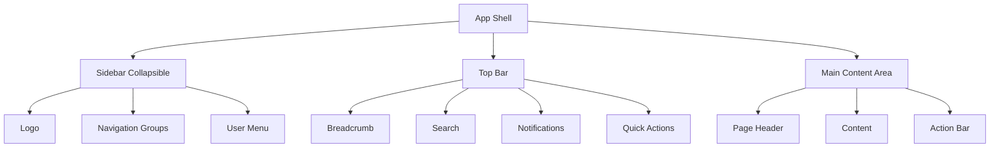

# Análisis Técnico y Propuesta de Rediseño - AutoOCR

## 1. Resumen Ejecutivo

AutoOCR es una aplicación Flask/Python para procesamiento de documentos con OCR, clasificación automática y chat documental con IA. El análisis revela múltiples problemas técnicos, funcionales y de usabilidad que requieren atención inmediata, junto con una oportunidad de mejora visual significativa.

---

## 2. Problemas Identificados

### 2.1 Problemas Técnicos

| # | Problema | Gravedad | Ubicación |
|---|----------|----------|-----------|
| T1 | **Conflicto de CSS dual**: Dos archivos (`modern.css` + `style.css`) con temas opuestos (oscuro vs claro) | Alta | `web_app/static/css/` |
| T2 | **Inyección SQL en decoradores**: Uso de f-strings en consultas SQL | Crítica | `security_decorators.py:56` |
| T3 | **Templates extremadamente grandes**: `document_detail.html` tiene 78KB+ | Media | `templates/document_detail.html` |
| T4 | **Sin paginación**: Carga todos los documentos sin límite | Alta | `routes/main_routes.py` |
| T5 | **Rate limiting en memoria**: Se pierde al reiniciar | Media | `app.py:97` |
| T6 | **Configuración duplicada en YAML**: Sección `llm` repetida dos veces | Baja | `config.yaml:140,297` |
| T7 | **Sin caché de static files**: No hay headers de cache | Media | `app.py` |
| T8 | **Singleton sin thread-safety adecuada**: Posibles race conditions | Media | `services.py` |

### 2.2 Problemas Funcionales

| # | Problema | Gravedad | Ubicación |
|---|----------|----------|-----------|
| F1 | **Búsqueda sin AJAX**: Recarga toda la página | Alta | `documents.html` |
| F2 | **Sin actualizaciones en tiempo real**: Estado de tareas requiere refresh | Alta | `templates/tasks.html` |
| F3 | **Chat no persistente**: Pierde historial al recargar | Media | `chat.html` |
| F4 | **Sin drag-and-drop real**: Solo simulado en upload | Media | `upload.html` |
| F5 | **Sin operaciones batch UI**: Requiere múltiples pasos | Media | Varias páginas |
| F6 | **No hay preview de PDF**: Solo descarga | Media | `document_detail.html` |
| F7 | **Sin notificaciones push**: Solo alerts simples | Baja | `main.js` |
| F8 | **Logout solo POST**: No permite logout con GET para enlaces | Baja | `auth_routes.py:38` |

### 2.3 Problemas de Usabilidad

| # | Problema | Gravedad | Ubicación |
|---|----------|----------|-----------|
| U1 | **Sidebar saturada**: Demasiados elementos de navegación | Alta | `base.html:30-122` |
| U2 | **Sin breadcrumbs**: Usuario se pierde en navegación profunda | Alta | `base.html` |
| U3 | **Loading states pobres**: Sin skeleton loaders | Media | General |
| U4 | **Botones inconsistentes**: Mezcla outline/solid sin criterio | Media | Varias páginas |
| U5 | **Accesibilidad deficiente**: Falta ARIA, poor contrast | Alta | General |
| U6 | **Input de chat no auto-resizable** | Baja | `chat.html:55` |
| U7 | **Sin keyboard shortcuts** (excepto Ctrl+K básico) | Baja | `main.js` |
| U8 | **Mobile sidebar colapsa mal**: Solo oculta texto, no funciona bien | Alta | `modern.css:80-105` |

---

## 3. Análisis de Causas Raíz

### T1 - Conflicto de CSS
**Causa**: Evolución orgánica del proyecto. `style.css` es el CSS original de Bootstrap modificado, mientras `modern.css` fue añadido posteriormente para un tema oscuro "premium". Ambos se cargan y chocan.

**Solución**: Consolidar en un solo CSS con arquitectura de variables CSS moderna.

### T2 - Inyección SQL
**Causa**: Uso de f-strings para construir queries dinámicamente en decoradores de seguridad. Patrón común en código legacy.

```python
# PROBLEMA - Línea 56
cursor.execute(f"SELECT hotel_id FROM documents WHERE id = {db.placeholder}", (val,))
```

**Solución**: Usar siempre consultas parametrizadas con placeholders.

### F1 - Búsqueda sin AJAX
**Causa**: Implementación rápida usando formulario HTML tradicional. No se consideró la experiencia de usuario.

**Solución**: Implementar búsqueda con debounce y AJAX.

### U1 - Sidebar saturada
**Causa**: Agregado progresivo de features sin diseño de información. No hay jerarquía visual clara.

**Solución**: Implementar navegación colapsable con grupos y tooltips.

---

## 4. Mejoras Recomendadas

### 4.1 Rendimiento

| Mejora | Impacto | Esfuerzo |
|--------|---------|----------|
| Implementar paginación (50 items/página) | Alto | Medio |
| Lazy loading de imágenes con IntersectionObserver | Alto | Bajo |
| Cache headers para static files (1 año) | Medio | Bajo |
| Virtual scrolling para listas grandes | Alto | Alto |
| Compresión Brotli/Gzip | Medio | Bajo |
| CDN para assets estáticos | Medio | Medio |

### 4.2 Seguridad

| Mejora | Impacto | Esfuerzo |
|--------|---------|----------|
| Corregir inyección SQL en decoradores | Crítico | Bajo |
| Rate limiting con Redis | Alto | Medio |
| Rotación de tokens de sesión | Medio | Medio |
| CAPTCHA en registro | Medio | Bajo |
| Validación de fortaleza de contraseña | Medio | Bajo |
| Headers de seguridad (CSP, HSTS) | Alto | Medio |
| Logging de auditoría mejorado | Medio | Bajo |

### 4.3 Escalabilidad

| Mejora | Impacto | Esfuerzo |
|--------|---------|----------|
| API REST verdadera (separar frontend) | Alto | Alto |
| WebSockets para real-time updates | Alto | Alto |
| Cache Redis para queries frecuentes | Alto | Medio |
| Message queue para procesos largos | Alto | Medio |
| Database connection pooling | Medio | Bajo |
| Horizontal scaling con Docker | Alto | Medio |

### 4.4 UX

| Mejora | Impacto | Esfuerzo |
|--------|---------|----------|
| Breadcrumbs en todas las páginas | Alto | Bajo |
| Skeleton loaders durante carga | Medio | Bajo |
| Búsqueda con autocomplete AJAX | Alto | Medio |
| Notificaciones toast persistentes | Medio | Bajo |
| Keyboard shortcuts completos | Medio | Bajo |
| Dark/Light mode toggle | Medio | Medio |
| Tutorial/onboarding para nuevos usuarios | Medio | Alto |

---

## 5. Propuesta de Rediseño Visual Completo

### 5.1 Filosofía de Diseño

**Nombre del nuevo diseño**: "Obsidian Flow"

**Principios fundamentales**:
1. **Minimalismo funcional**: Cada elemento debe justificar su existencia
2. **Jerarquía visual clara**: El contenido prima sobre la decoración
3. **Micro-interacciones significativas**: Feedback visual en cada acción
4. **Accesibilidad por defecto**: WCAG 2.1 AA como mínimo

### 5.2 Estructura de Layout



**Especificaciones**:
- Sidebar: 280px expandida, 72px colapsada (iconos solo)
- Top bar: 64px altura fija
- Contenido: Max-width 1400px, centrado
- Espaciado base: 8px grid (8, 16, 24, 32, 48, 64)

### 5.3 Paleta de Colores

```css
:root {
    /* Primary - Deep Teal */
    --color-primary: #0d9488;
    --color-primary-hover: #0f766e;
    --color-primary-light: #14b8a6;
    --color-primary-dark: #115e59;
    
    /* Secondary - Warm Slate */
    --color-secondary: #64748b;
    --color-secondary-hover: #475569;
    
    /* Backgrounds */
    --bg-base: #0f172a;        /* Slate 900 - Main background */
    --bg-surface: #1e293b;     /* Slate 800 - Cards */
    --bg-elevated: #334155;    /* Slate 700 - Elevated elements */
    --bg-overlay: #020617;     /* Slate 950 - Deepest background */
    
    /* Text */
    --text-primary: #f8fafc;   /* Slate 50 */
    --text-secondary: #94a3b8; /* Slate 400 */
    --text-muted: #64748b;     /* Slate 500 */
    
    /* Semantic */
    --color-success: #10b981;
    --color-warning: #f59e0b;
    --color-error: #ef4444;
    --color-info: #3b82f6;
    
    /* Borders */
    --border-subtle: rgba(148, 163, 184, 0.1);
    --border-default: rgba(148, 163, 184, 0.2);
    --border-strong: rgba(148, 163, 184, 0.3);
    
    /* Shadows */
    --shadow-sm: 0 1px 2px rgba(0, 0, 0, 0.3);
    --shadow-md: 0 4px 6px -1px rgba(0, 0, 0, 0.3);
    --shadow-lg: 0 10px 15px -3px rgba(0, 0, 0, 0.4);
    --shadow-glow: 0 0 20px rgba(13, 148, 136, 0.3);
}
```

**Justificación**: 
- El color teal (#0d9488) transmite tecnología y confianza
- Los tonos slate proporcionan profundidad sin ser completamente negros
- Alto contraste para accesibilidad (ratio > 4.5:1)
- Colores semánticos siguen convenciones universales

### 5.4 Tipografía

```css
/* Font Stack */
--font-display: 'Outfit', sans-serif;  /* Headings - Modern geometric */
--font-body: 'Inter', sans-serif;       /* Body - Highly readable */
--font-mono: 'JetBrains Mono', monospace; /* Code/Data */

/* Scale */
--text-xs: 0.75rem;      /* 12px */
--text-sm: 0.875rem;     /* 14px */
--text-base: 1rem;       /* 16px */
--text-lg: 1.125rem;     /* 18px */
--text-xl: 1.25rem;      /* 20px */
--text-2xl: 1.5rem;      /* 24px */
--text-3xl: 1.875rem;    /* 30px */
--text-4xl: 2.25rem;     /* 36px */

/* Weights */
--font-normal: 400;
--font-medium: 500;
--font-semibold: 600;
--font-bold: 700;

/* Line Heights */
--leading-tight: 1.25;
--leading-normal: 1.5;
--leading-relaxed: 1.75;
```

**Justificación**:
- Outfit: Fuente geométrica moderna, excelente para headings
- Inter: La fuente más legible para interfaces, diseñada para pantallas
- JetBrains Mono: Optimizada para código, fácil de distinguir caracteres

### 5.5 Componentes

#### Botones
```css
.btn {
    display: inline-flex;
    align-items: center;
    justify-content: center;
    gap: 0.5rem;
    padding: 0.625rem 1.25rem;
    font-size: 0.875rem;
    font-weight: 500;
    border-radius: 0.5rem;
    transition: all 0.2s ease;
    cursor: pointer;
    border: none;
}

.btn-primary {
    background: var(--color-primary);
    color: white;
}
.btn-primary:hover {
    background: var(--color-primary-hover);
    transform: translateY(-1px);
    box-shadow: var(--shadow-glow);
}

.btn-secondary {
    background: var(--bg-elevated);
    color: var(--text-primary);
}
.btn-secondary:hover {
    background: var(--border-strong);
}

.btn-ghost {
    background: transparent;
    color: var(--text-secondary);
}
.btn-ghost:hover {
    background: var(--bg-elevated);
    color: var(--text-primary);
}
```

#### Tarjetas (Cards)
```css
.card {
    background: var(--bg-surface);
    border: 1px solid var(--border-subtle);
    border-radius: 0.75rem;
    padding: 1.5rem;
    transition: all 0.2s ease;
}

.card:hover {
    border-color: var(--border-default);
    box-shadow: var(--shadow-md);
}

.card-interactive:hover {
    transform: translateY(-2px);
    box-shadow: var(--shadow-lg);
}
```

#### Formularios
```css
.form-input {
    width: 100%;
    padding: 0.75rem 1rem;
    background: var(--bg-base);
    border: 1px solid var(--border-default);
    border-radius: 0.5rem;
    color: var(--text-primary);
    font-size: 0.875rem;
    transition: all 0.2s ease;
}

.form-input:focus {
    outline: none;
    border-color: var(--color-primary);
    box-shadow: 0 0 0 3px rgba(13, 148, 136, 0.2);
}

.form-input::placeholder {
    color: var(--text-muted);
}
```

#### Tablas
```css
.data-table {
    width: 100%;
    border-collapse: separate;
    border-spacing: 0;
}

.data-table th {
    padding: 0.75rem 1rem;
    text-align: left;
    font-size: 0.75rem;
    font-weight: 600;
    text-transform: uppercase;
    letter-spacing: 0.05em;
    color: var(--text-muted);
    background: var(--bg-elevated);
    border-bottom: 1px solid var(--border-default);
}

.data-table td {
    padding: 1rem;
    border-bottom: 1px solid var(--border-subtle);
    font-size: 0.875rem;
}

.data-table tr:hover td {
    background: var(--bg-elevated);
}
```

### 5.6 Navegación Sidebar

```css
.sidebar {
    width: 280px;
    height: 100vh;
    background: var(--bg-surface);
    border-right: 1px solid var(--border-subtle);
    display: flex;
    flex-direction: column;
    position: fixed;
    left: 0;
    top: 0;
    z-index: 100;
    transition: width 0.3s ease;
}

.sidebar.collapsed {
    width: 72px;
}

.nav-group {
    margin-bottom: 1.5rem;
}

.nav-group-title {
    padding: 0.5rem 1rem;
    font-size: 0.7rem;
    font-weight: 600;
    text-transform: uppercase;
    letter-spacing: 0.1em;
    color: var(--text-muted);
}

.nav-item {
    display: flex;
    align-items: center;
    gap: 0.75rem;
    padding: 0.75rem 1rem;
    color: var(--text-secondary);
    text-decoration: none;
    border-radius: 0.5rem;
    margin: 0.25rem 0.5rem;
    transition: all 0.15s ease;
}

.nav-item:hover {
    background: var(--bg-elevated);
    color: var(--text-primary);
}

.nav-item.active {
    background: rgba(13, 148, 136, 0.15);
    color: var(--color-primary);
}

.nav-item i {
    width: 20px;
    text-align: center;
    font-size: 1rem;
}
```

### 5.7 Página de Login/Auth

```css
.auth-page {
    min-height: 100vh;
    display: flex;
    align-items: center;
    justify-content: center;
    background: var(--bg-overlay);
    background-image: 
        radial-gradient(ellipse at top, rgba(13, 148, 136, 0.15) 0%, transparent 50%),
        radial-gradient(ellipse at bottom right, rgba(59, 130, 246, 0.1) 0%, transparent 50%);
}

.auth-card {
    width: 100%;
    max-width: 400px;
    background: var(--bg-surface);
    border: 1px solid var(--border-subtle);
    border-radius: 1rem;
    padding: 2.5rem;
    box-shadow: var(--shadow-lg);
}

.auth-logo {
    text-align: center;
    margin-bottom: 2rem;
}

.auth-logo h1 {
    font-family: var(--font-display);
    font-size: 2rem;
    font-weight: 700;
    color: var(--text-primary);
    letter-spacing: -0.02em;
}

.auth-logo span {
    color: var(--color-primary);
}
```

### 5.8 Dashboard

```css
.dashboard-stats {
    display: grid;
    grid-template-columns: repeat(auto-fit, minmax(240px, 1fr));
    gap: 1.5rem;
    margin-bottom: 2rem;
}

.stat-card {
    background: var(--bg-surface);
    border: 1px solid var(--border-subtle);
    border-radius: 0.75rem;
    padding: 1.5rem;
    display: flex;
    align-items: flex-start;
    gap: 1rem;
}

.stat-icon {
    width: 48px;
    height: 48px;
    border-radius: 0.75rem;
    display: flex;
    align-items: center;
    justify-content: center;
    font-size: 1.25rem;
}

.stat-icon.success { background: rgba(16, 185, 129, 0.15); color: var(--color-success); }
.stat-icon.warning { background: rgba(245, 158, 11, 0.15); color: var(--color-warning); }
.stat-icon.error { background: rgba(239, 68, 68, 0.15); color: var(--color-error); }
.stat-icon.info { background: rgba(59, 130, 246, 0.15); color: var(--color-info); }

.stat-content h3 {
    font-size: 1.75rem;
    font-weight: 700;
    color: var(--text-primary);
    margin: 0;
    line-height: 1;
}

.stat-content p {
    font-size: 0.875rem;
    color: var(--text-muted);
    margin: 0.25rem 0 0 0;
}
```

### 5.9 Chat Interface

```css
.chat-container {
    display: flex;
    flex-direction: column;
    height: calc(100vh - 180px);
    background: var(--bg-surface);
    border: 1px solid var(--border-subtle);
    border-radius: 0.75rem;
    overflow: hidden;
}

.chat-messages {
    flex: 1;
    overflow-y: auto;
    padding: 1.5rem;
    display: flex;
    flex-direction: column;
    gap: 1rem;
}

.message {
    max-width: 80%;
    padding: 1rem 1.25rem;
    border-radius: 1rem;
    font-size: 0.9375rem;
    line-height: 1.5;
}

.message-user {
    align-self: flex-end;
    background: var(--color-primary);
    color: white;
    border-bottom-right-radius: 0.25rem;
}

.message-assistant {
    align-self: flex-start;
    background: var(--bg-elevated);
    color: var(--text-primary);
    border-bottom-left-radius: 0.25rem;
}

.chat-input-container {
    padding: 1rem;
    border-top: 1px solid var(--border-subtle);
    background: var(--bg-base);
}

.chat-input {
    display: flex;
    gap: 0.75rem;
    align-items: flex-end;
}

.chat-input textarea {
    flex: 1;
    resize: none;
    min-height: 44px;
    max-height: 120px;
}
```

### 5.10 Animaciones y Transiciones

```css
/* Base transitions */
:root {
    --transition-fast: 0.15s ease;
    --transition-normal: 0.2s ease;
    --transition-slow: 0.3s ease;
}

/* Page transitions */
@keyframes fadeIn {
    from { opacity: 0; }
    to { opacity: 1; }
}

@keyframes slideUp {
    from { 
        opacity: 0;
        transform: translateY(10px);
    }
    to { 
        opacity: 1;
        transform: translateY(0);
    }
}

@keyframes slideIn {
    from {
        opacity: 0;
        transform: translateX(-10px);
    }
    to {
        opacity: 1;
        transform: translateX(0);
    }
}

.animate-fade-in {
    animation: fadeIn 0.3s ease forwards;
}

.animate-slide-up {
    animation: slideUp 0.4s ease forwards;
}

/* Stagger children */
.stagger-children > * {
    opacity: 0;
    animation: slideUp 0.4s ease forwards;
}
.stagger-children > *:nth-child(1) { animation-delay: 0ms; }
.stagger-children > *:nth-child(2) { animation-delay: 50ms; }
.stagger-children > *:nth-child(3) { animation-delay: 100ms; }
.stagger-children > *:nth-child(4) { animation-delay: 150ms; }
.stagger-children > *:nth-child(5) { animation-delay: 200ms; }
```

---

## 6. Plan de Implementación

### Fase 1: Fundamentos (Semana 1-2)
1. [ ] Consolidar CSS en un solo archivo
2. [ ] Implementar sistema de diseño base (variables, reset, tipografía)
3. [ ] Corregir vulnerabilidad de inyección SQL
4. [ ] Implementar paginación en documentos

### Fase 2: Componentes (Semana 3-4)
1. [ ] Crear componentes reutilizables (botones, cards, inputs, tablas)
2. [ ] Rediseñar sidebar con navegación colapsable
3. [ ] Implementar breadcrumbs
4. [ ] Añadir skeleton loaders

### Fase 3: Funcionalidad (Semana 5-6)
1. [ ] Búsqueda AJAX con debounce
2. [ ] Notificaciones toast mejoradas
3. [ ] WebSocket para actualizaciones en tiempo real
4. [ ] Persistencia de chat

### Fase 4: Optimización (Semana 7-8)
1. [ ] Cache headers y optimización de assets
2. [ ] Lazy loading de imágenes
3. [ ] Mejora de accesibilidad (ARIA, focus states)
4. [ ] Testing y polish

---

## 7. Métricas de Éxito

| Métrica | Actual | Objetivo |
|---------|--------|----------|
| Lighthouse Performance | ~60 | >90 |
| Lighthouse Accessibility | ~70 | >95 |
| First Contentful Paint | ~2s | <1s |
| Time to Interactive | ~4s | <2s |
| CLS (Cumulative Layout Shift) | ~0.3 | <0.1 |
| User Satisfaction Score | N/A | >4.5/5 |

---

*Documento generado automáticamente. Fecha: 2026-02-26*