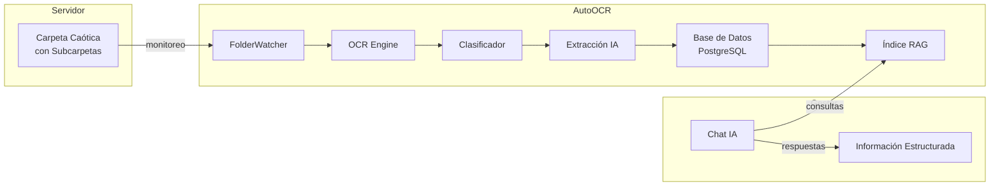

# Plan de Adaptación: AutoOCR para Empresa de Decoración e Interiorismo

## Resumen del Enfoque

**Concepto clave**: La estructura de carpetas es irrelevante. El sistema procesará todos los documentos mediante OCR, extraerá la información relevante (proveedores, importes, fechas, tipos) y la almacenará de forma estructurada en la base de datos.

El chat con IA permitirá consultar esta información ordenada directamente, sin importar cómo estaba organizada la carpeta original.

---

## Cómo Funciona el Sistema

### Flujo de Trabajo

```
Carpeta Caótica del Servidor
         │
         ▼
    ┌─────────────┐
    │   OCR       │  ← Extrae texto de PDF, imágenes, etc.
    │  (Paddle)  │
    └─────────────┘
         │
         ▼
    ┌─────────────┐
    │ Clasificador│  ← Detecta tipo: factura, presupuesto, plano...
    └─────────────┘
         │
         ▼
    ┌─────────────┐
    │ Extracción  │  ← Extrae: proveedor, total, fecha, número pedido...
    │  (IA)       │     DEL PROPIO DOCUMENTO
    └─────────────┘
         │
         ▼
    ┌─────────────┐
    │   Base de   │  ← Información estructurada y searchable
    │   Datos     │
    └─────────────┘
         │
         ▼
    ┌─────────────┐
    │  Índice     │  ← Embeddings para búsqueda semántica
    │    RAG      │
    └─────────────┘
         │
         ▼
    ┌─────────────┐
    │ Chat con IA │  ← "Dame todas las facturas de IKEA"
    └─────────────┘
```

### Extracción Automática de Proveedores

El sistema ya extrae el nombre del proveedor **directamente del documento** mediante OCR. No requiere configuración previa:

- Lee "Leroy Merlin S.A." → Normaliza a "Leroy Merlin"
- Lee "IKEA IBÉRICA" → Normaliza a "IKEA"
- Lee cualquier nombre de empresa → Lo almacena en el campo `vendor`

Esto funciona para **cientos de proveedores** porque el sistema no tiene una lista fija - lee lo que aparece en cada documento.

---

## Estado Actual del Sistema

| Componente | Estado | Notas |
|------------|--------|-------|
| OCR de documentos | ✅ Listo | PDF, imágenes, Word, Excel |
| Extracción de proveedor | ✅ Listo | Lee el nombre del documento |
| Extracción de importe | ✅ Listo | Detecta totales, IVA |
| Extracción de fecha | ✅ Listo | Diversos formatos |
| Extracción de número | ✅ Listo | Factura, pedido, presupuesto |
| Clasificación automática | ✅ Listo | Factura, contrato, presupuesto... |
| Chat con RAG | ✅ Listo | Búsqueda semántica |
| Hot-folder | ⚠️ Deshabilitado | Requiere habilitar |

---

## Plan de Implementación

### Fase 1: Habilitar Monitoreo de Carpetas

#### 1.1 Configurar Hot-Folder

Editar [`config.yaml`](config.yaml:80):

```yaml
postbatch:
  hot_folder:
    enabled: true                    # Cambiar a true
    path: "C:\\Ruta\\a\\Carpeta\\Servidor"  # Tu carpeta caótica
    recursive: true                 # Procesar subcarpetas también
    extensions:
      - .pdf
      - .jpg
      - .jpeg
      - .png
      - .docx
      - .xlsx
      - .xls
```

**Importante**: El sistema procesará TODOS los archivos de esa carpeta, sin importar su organización.

---

### Fase 2: Mejorar Extracción para Decoración

#### 2.1 Añadir Tipos de Documentos del Sector

Modificar [`modules/classifier.py`](modules/classifier.py:30) para detectar documentos típicos de decoración:

```python
KEYWORDS = {
    # ... tipos existentes ...
    "Presupuesto": ["presupuesto", "presupuestación", "presupuestar"],
    "Pedido": ["pedido", "orden de compra", "solicitud de pedido"],
    "Albarán": ["albarán", "álbaran", "entrega", "recepción"],
    "Plano": ["plano", "planta", "alzado", "sección", "detalle"],
}
```

#### 2.2 Configurar Extracción de Datos Relevantes

El sistema ya extrae automáticamente:
- **Proveedor**: Del texto del documento
- **Importe**: Total, IVA, subtotal
- **Fecha**: Diversos formatos
- **Número de documento**: Factura, pedido, presupuesto

**No requiere configuración** - el sistema lee lo que aparece en cada documento.

---

### Fase 3: Chat y Consultas

#### 3.1 Consultas Posibles

Una vez procesados los documentos, los gestores pueden preguntar al chat:

| Pregunta del Gestor | Qué Retorna |
|---------------------|-------------|
| "Dame todas las facturas de [proveedor X]" | Lista de facturas de ese proveedor |
| "Presupuestos del proyecto [nombre]" | Todos los presupuestos |
| "Total gastado en [proveedor]" | Sumatorio de importes |
| "Documentos del mes de enero" | Filtrado por fecha |
| "Dame los pedidos pendientes" | Según clasificación |

#### 3.2 Búsqueda Directa

También se puede buscar por:
- Nombre del proveedor (extraído automáticamente)
- Tipo de documento
- Rango de fechas
- Rango de importes

---

## Arquitectura del Sistema Propuesto



---

## Lista de Tareas de Implementación

### Configuración Inicial

- [ ] **T.1** Habilitar hot-folder en `config.yaml`
- [ ] **T.2** Establecer ruta de carpeta del servidor
- [ ] **T.3** Añadir extensiones de archivos (.dwg, .dxf para planos)

### Extracción y Clasificación

- [ ] **T.4** Añadir tipos de documentos de decoración al clasificador
- [ ] **T.5** Verificar extracción de campos relevantes

### Chat y UI

- [ ] **T.6** Personalizar prompts para consultas de decoración
- [ ] **T.7** Configurar dashboard para proyectos

---

## Preguntas Frecuentes del Chat

Una vez implementado, los gestores podrán preguntar:

```
"Dame todos los proveedores que aparecen en los documentos"
"Muéstrame las facturas de los últimos 3 meses"
"¿Cuánto hemos gastado en total en suministros?"
"Busca documentos que mentionen 'mármol' o 'granito'"
"Dame el historial de pedidos a [proveedor específico]"
```

---

## Conclusión

El sistema AutoOCR ya está diseñado para:

1. ✅ **Procesar carpetas desorganizadas** - No necesita estructura previa
2. ✅ **Extraer proveedores automáticamente** - Del texto de cada documento
3. ✅ **Almacenar información estructurada** - En PostgreSQL
4. ✅ **Buscar con chat IA** - Consulta en lenguaje natural

Solo necesita habilitar el hot-folder y apuntar a la carpeta del servidor. El resto funciona automáticamente.

**No es necesaria configuración de proveedores** - el sistema los detecta leyendo los documentos.
